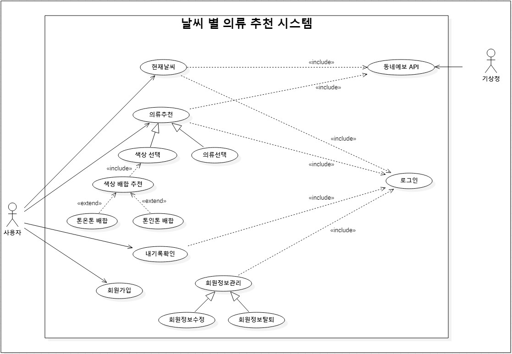
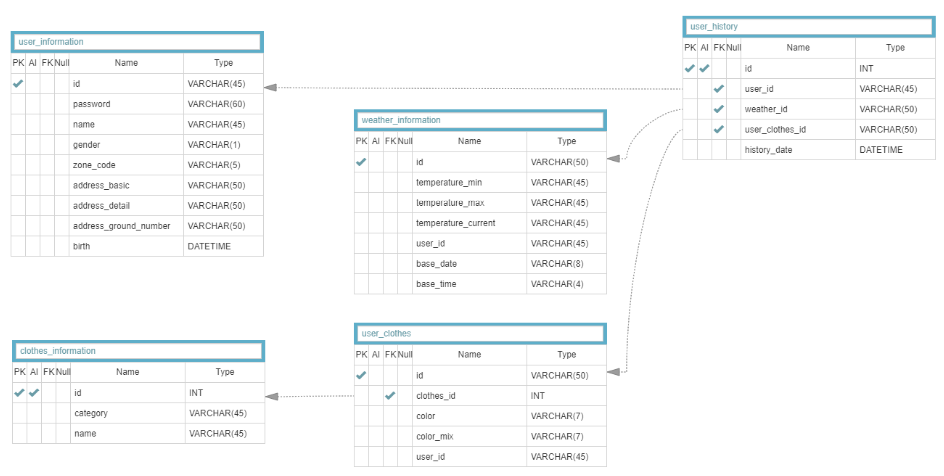
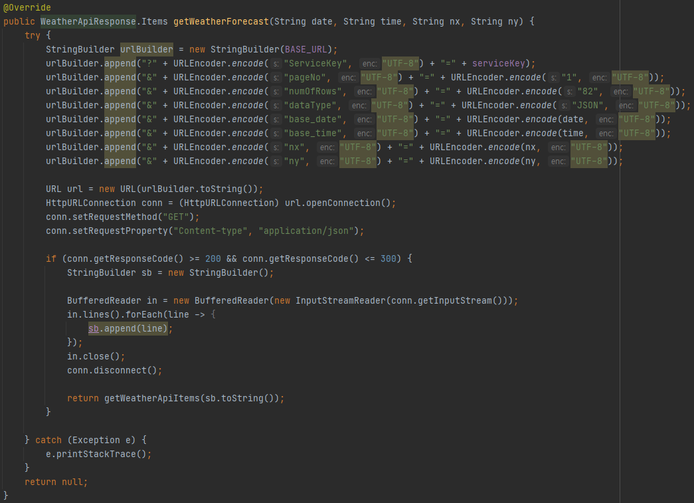
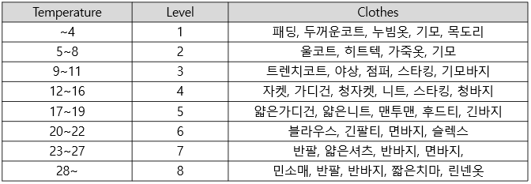
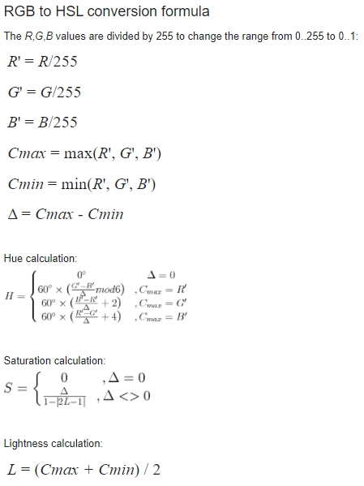
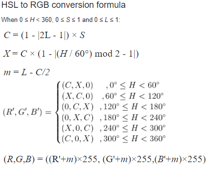
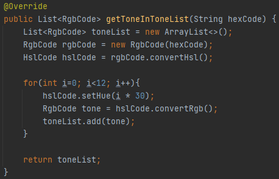
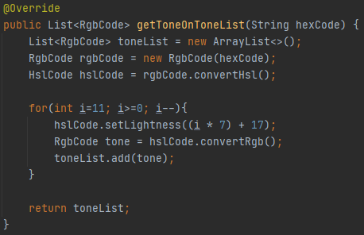

# 날씨 빅데이터를 이용한 의류추천 웹서비스
날씨 빅데이터를 이용한 의류추천 웹서비스 구축

### 1. 개발환경
> Backend: SpringBoot 
> Frontend: React.js

### 2. 프로젝트 초기 환경 구축
> 1. git clone
> 2. 프로젝트 application.properties에 자신의 db 정보, api 정보를 입력
> 3. git bash에 git rm -r --cached . 입력하여 캐시삭제 후 git add .
> 4. 작업시작

### 3. 시스템 설계
#### 3-1.시스템 구조
>    
> **유저 정보 관리 모듈**
> * 회원가입 : 데이터베이스에 회원정보 저장
> * 유저정보 : 데이터베이스에 회원정보 조회
> * 정보수정 : 데이터베이스에 회원정보 수정
> * 회원탈퇴 : 데이터베이스에 회원정보 삭제
> * 유저기록 : 의류추천 기록 조회 및 삭제  
> 
> **날씨 정보 관리 모듈**  
> * 날씨 API : 기상청 동네예보 API 이용하여 실시간 날씨 정보 수집
> * 날씨 조회 : 데이터베이스에 날씨정보 조회
> * 날씨 삽입 : 데이터베이스에 날씨정보 삽입
> * 날씨 삭제 : 데이터베이스에 날씨정보 삭제  
>
> **의류 정보 관리 모듈**  
> * 의류 추천 : 기온 별 의상 추천 테이블 기반 의류추천 알고리즘
> * 의류 조회 : 데이터베이스에 의류정보 조회  
> 
> **색상 정보 관리 모듈**  
> * RGB-HSL 변환 : 색상정보 - RGB 코드와 HSL 코드 변환 알고리즘
> * 톤인톤 배합 : 한 색상에 대한 12가지 톤인톤 배색 반환
> * 톤온톤 배합 : 한 색상에 대한 12가지 톤온톤 배색 반환  
> 
> **데이터베이스**
> * 유저정보 : 유저 정보 테이블
> * 유저기록 : 선택한 의류 및 색상이 담긴 기록 정보 테이블
> * 날씨정보 : 날씨 정보 테이블
> * 의류정보 : 의류 정보 테이블
> * 유저선택 의류 : 선택한 의류 정보 테이블  
> 

#### 3-2.유스케이스
>   
> > 1. 사용자 액터는 로그인을 하여 다른 유스케이스에 접근 가능
> > 2. 기상청 외부 액터로부터 동네예보 API 유스케이스에 접근

#### 3-3.ERD
>    
> **테이블 정보**
> > 1. user_information : 유저정보 테이블
> > 2. weather_information : 날씨정보 테이블
> > 3. clothes_information : 의류정보 테이블
> > 4. user_clothes : 유저 선택의류 테이블
> > 5. user_history : 유저 기록 테이블
> 
### 4. 주요 기능 구현
#### 4-1.동네예보 API를 이용한 실시간 날씨 정보 수집 기능
>   
> serviceKey를 이용하여 동네예보 API에 대한 URL에 접근
> 
#### 4-2.날씨 별 의류 추천
> **날씨별 의류 추천 테이블**  
>   
> 해당 테이블의 기온 별 level를 참고하여 데이터베이스에 조회
>
#### 4-3.RGB-HSL 변환
> ***RGB-HSL 변환 식**    
>   
> 
> ***HSL-RGB 변환 식**    
>   
#### 4-4.톤인톤/톤인톤 배합 알고리즘
> **톤인톤 배합**  
>   
> HSL 색상 모델에서 Hue(색상) 값을 변경    
> **톤온톤 배합**  
>   
> HSL 색상 모델에서 Lightness(밝기) 값을 변경
